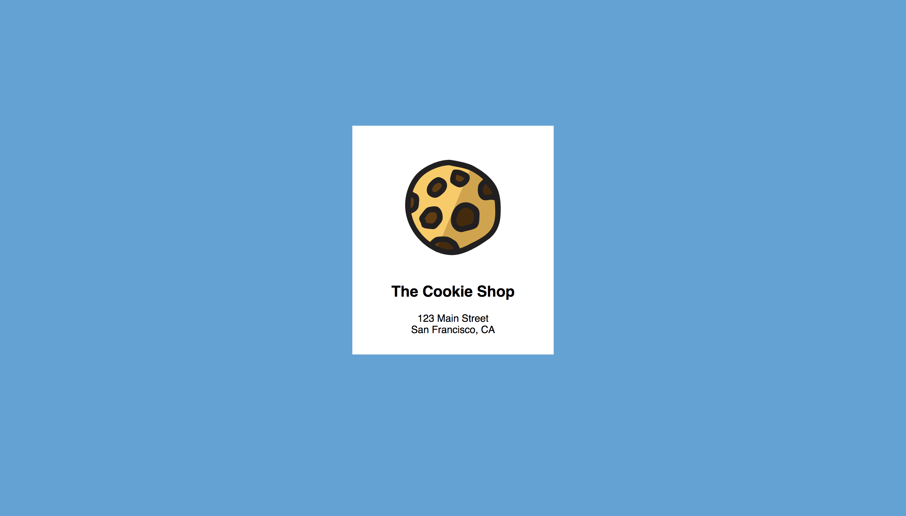
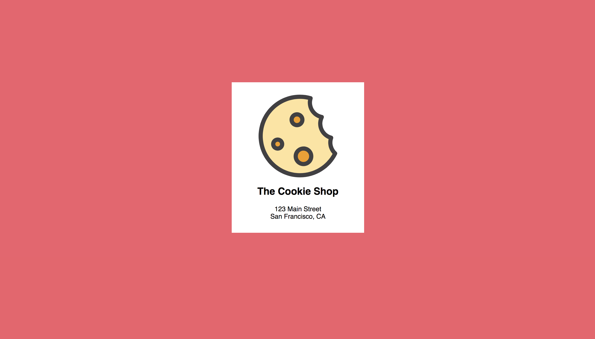

# LAB 4 - Rolling Update avec les deployments.

Maintenant que nous avons la possibilité de mettre à l'échelle nos applications en utilisant les ReplicaSets. Nous allons voir dans ce lab comment mettre à jour facilement une application sans interruption de service grâce aux deployment.

**Rappel :**

Un Deployment est une structure qui permet de gérer de façon transparente un ReplicaSet et de lui fournir une fonctionnalité de mise à jour/rollback.

## Déploiement

Nous allons commencer par recréer notre application en utilisant un deployment. Pour ce faire, il vous suffit d'exécuter les commandes suivantes : 

```bash
cd Lab-3/
$ kubectl create ns k8s-lab-2
$ kubectl apply -f cookie-app-deployment.yml -n k8s-lab-2
```

Vérifions ensuite l'état de notre deployment :

```bash
$ kubectl get deployments -n k8s-lab-4

NAME                     DESIRED   CURRENT   UP-TO-DATE   AVAILABLE   AGE
cookie-app               2         2         2            2           30s
```

Si on s'interesse au résultat ci-dessus, nous demandons à Kubernetes au travers d'un deployment de nous créer 2 pods pour notre application _(DESIRED)_ et nous en avons actuellement 2 qui ont été provisionné _(CURRENT)_.

Affichons les pods via la commande suivante : 

```bash
$ kubectl get pod -n k8s-lab-4

NAME                                      READY   STATUS    RESTARTS   AGE
cookie-app-cbc46b948-6j55s                1/1     Running   0          3m54s
cookie-app-cbc46b948-j849b                1/1     Running   0          3m54s
```

Nous retrouvons bien nos 2 pods.

Exposons ensuite notre application en utilisant un service de type LoadBalancer :

```bash
$ kubectl apply -f cookie-app-service.yml -n k8s-lab-4
NAME            TYPE           CLUSTER-IP      EXTERNAL-IP      PORT(S)        AGE
simple-webapp   LoadBalancer   10.106.106.98   104.xx.xxx.xx   80:30062/TCP   4m57s
```

Ouvrez votre navigateur web et vérifier l'accessibilité de votre application web.



Maintenant mettons à jour notre application en changeant l'image de notre conteneur. Pour ce faire, exécutez la commande suivante : 

```bash
$ kubectl set image deployment/cookie-app webapp=quay.io/coreos/example-app:v2.0 -n k8s-lab-4

deployment.extensions/cookie-app image updated
```

Vérifiez l'état de votre deployment en exécutant la commande suivante : 

```bash
$ kubectl rollout status deployment/cookie-app -n k8s-lab-4

deployment "cookie-app" successfully rolled out
```

Retournez sur votre navigateur web et rafraichissez votre page



**TADAAAA !** Vous avez mis à jour votre application instantanément.

**NB**: Si vous ne voyez pas de changement pensez à nettoyer le cache de votre navigateur web.

Si, la nouvelle version de l'application ne correespond pas à nos attentes nous avons la possibilité avec les deployment de revenir à une version antérieur.

Pour ce faire, il vous suffit de suivre les étapes suivantes : 

Afficher la liste des versions (revisions)

```bash
$ kubectl rollout history deployment/cookie-app -n k8s-lab-4

REVISION  CHANGE-CAUSE
1         <none>
2         <none>
```

Si vous voulez avoir les détails d'une version, il vous suffit d'exécuter la commande suivante : 

```bash
$ kubectl rollout history deployment/cookie-app -n k8s-lab-4

deployment.extensions/cookie-app with revision #1
Pod Template:
  Labels:	app=cookie
	pod-template-hash=cbc46b948
  Containers:
   webapp:
    Image:	quay.io/coreos/example-app:v1.0
    Port:	80/TCP
    Host Port:	0/TCP
    Environment:	<none>
    Mounts:	<none>
  Volumes:	<none>
```

C'est la version qui nous interesse. Pour revenir à cette version, il vous suffit maintenant d'exécuter la commande suivante : 

```bash
$ kubectl rollout undo deployment/cookie-app -n k8s-lab-4 --to-revision 1

deployment.extensions/cookie-app
```

Rafraichissez à nouveau votre navigateur.


Et voila, vous êtes revenu à une version antérieur de votre application sans provoquer d'interruption de service.

