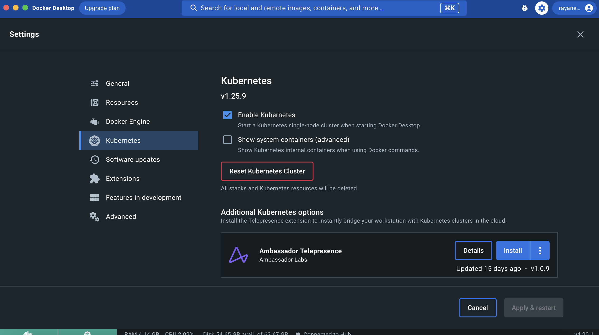

# LAB 5: START YOUR FIRST KUBERNETES CLUSTER

## Objective

Learn how to quickly start a Kubernetes cluster on your machine and interact with it.

## Instructions

- Start a kubernetes cluster with Docker Desktop.
  - Enable Kubernetes module in Docker Desktop settings



- Install kubectl
  - https://kubernetes.io/docs/tasks/tools/

Read the official documentation and follow the instruction to install `kubectl`

- Interact with your kubernetes cluster through kubectl
  - List all the namespaces
  
    ```bash
    kubectl get ns
    ```
  - List all the nodes

    ```bash
    kubectl get nodes
    ```
  - List all the pods in kube-system namespace

    ```bash
    kubectl get pods -n kube-system
    ```
